Introduction
------------

Sandstones one of the most common types of reservoir rocks. Let's see if we can explain their permeability.

Narrative
---------

The most well-known physics-based approach to estimating permeability was developed by Kozeny (1927) and later modified by Carman (1937). In its modern form, the equation is written as
which, for simplicity, we're going to recast as
where permeability is *k*, porosity is *ϕ*, tortuosity is *τ*, the specific surface area is *a*, and the Carman-Kozeny void fraction is *ϕ*<sub>*C**K*</sub>. For an uncemented sandstone, tortuosity can be calculated following the derivation in Appendix B, which comes from Panda and Lake (1994). For a cemented sandstone, the tortuosity changes because of cements blocking and forcing modification of the flow paths.

Specific surface area for an uncemented sandstone can be estimated from the particle size distribution, after assuming that the particles are spherical. After cementation, the nature of the cement is important in how the surface area changes. Some cements will coat the walls of the pores, slightly decreasing the specific surface area. Other cements will line or bridge the pores, moderately to greatly increasing the specific surface area.

A competing hypothesis is that pore throat sizes are the most important determinant of permeability-porosity transforms. This appears in the Winland relations that follow the form
where *r* is the pore throat radius. Pore throat radius might be more impacted by cements that coat the walls than cements that bridge the pores. Wouldn't that be interesting?

Now, because this is a data-driven approach, let's start by comparing permeability to the Carman-Kozeny void fraction.

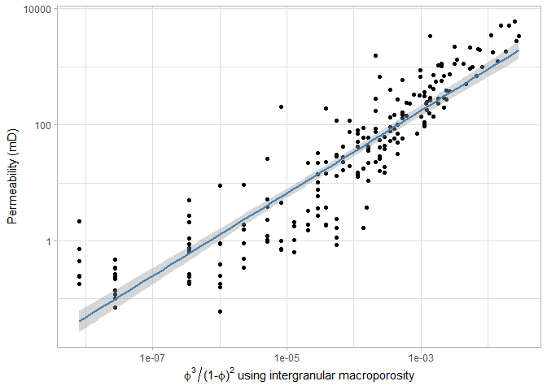

    ## 
    ## Call:
    ## lm(formula = log(KLH) ~ log(CK_void_fraction), data = df)
    ## 
    ## Residuals:
    ##     Min      1Q  Median      3Q     Max 
    ## -3.2600 -0.8124  0.0698  0.7935  3.9761 
    ## 
    ## Coefficients:
    ##                       Estimate Std. Error t value Pr(>|t|)    
    ## (Intercept)           10.08803    0.24257   41.59   <2e-16 ***
    ## log(CK_void_fraction)  0.71222    0.02298   30.99   <2e-16 ***
    ## ---
    ## Signif. codes:  0 '***' 0.001 '**' 0.01 '*' 0.05 '.' 0.1 ' ' 1
    ## 
    ## Residual standard error: 1.261 on 213 degrees of freedom
    ## Multiple R-squared:  0.8185, Adjusted R-squared:  0.8176 
    ## F-statistic: 960.5 on 1 and 213 DF,  p-value: < 2.2e-16

Hey! That's pretty good! The R**<sup>2</sup> is 0.85, and there are no odd trends. Sure, at low porosity the data resolution starts to be a problem, but that is at 1/100th of the average permeability, and "the permeability is bad" is really all you need to know there. Okay, with that positive result, let's add the grain size distribution to the model and see if we can do even better. With the grain size, we can start talking about the surface area of the pores. Bird et al. (1960) say that permeability is related to the square of the pore radius, which is roughly equivalent to the square of the grain diameter.


    ## 
    ## Call:
    ## lm(formula = log(KLH) ~ log(k_pred), data = mutate(df, k_pred = mean_GS^2 * 
    ##     CK_void_fraction))
    ## 
    ## Residuals:
    ##     Min      1Q  Median      3Q     Max 
    ## -3.2742 -0.8639  0.0866  0.8664  4.0401 
    ## 
    ## Coefficients:
    ##             Estimate Std. Error t value Pr(>|t|)    
    ## (Intercept)  1.45598    0.10427   13.96   <2e-16 ***
    ## log(k_pred)  0.69914    0.02359   29.64   <2e-16 ***
    ## ---
    ## Signif. codes:  0 '***' 0.001 '**' 0.01 '*' 0.05 '.' 0.1 ' ' 1
    ## 
    ## Residual standard error: 1.307 on 213 degrees of freedom
    ## Multiple R-squared:  0.8048, Adjusted R-squared:  0.8039 
    ## F-statistic: 878.5 on 1 and 213 DF,  p-value: < 2.2e-16

Well, our Pearson correlation coefficent has gone down to 0.64. Nuts. Well, it's pretty hard to estimate the mean grain size from looking at Beard and Weyl's comparators, so I can understand that. Or... how well-sorted are these grains? Not that well-sorted? Then let's do a specific surface area that takes that into account, with Panda and Lake's derivation.

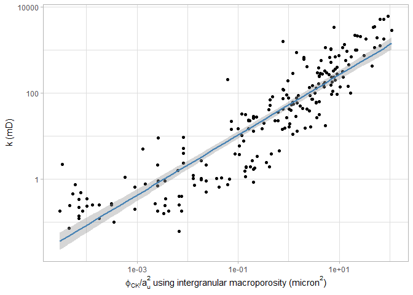

    ## 
    ## Call:
    ## lm(formula = log(KLH) ~ log(k_pred), data = mutate(df, k_pred = CK_void_fraction/a_u^2))
    ## 
    ## Residuals:
    ##     Min      1Q  Median      3Q     Max 
    ## -3.2742 -0.8639  0.0866  0.8664  4.0401 
    ## 
    ## Coefficients:
    ##             Estimate Std. Error t value Pr(>|t|)    
    ## (Intercept)  3.96136    0.09422   42.05   <2e-16 ***
    ## log(k_pred)  0.69914    0.02359   29.64   <2e-16 ***
    ## ---
    ## Signif. codes:  0 '***' 0.001 '**' 0.01 '*' 0.05 '.' 0.1 ' ' 1
    ## 
    ## Residual standard error: 1.307 on 213 degrees of freedom
    ## Multiple R-squared:  0.8048, Adjusted R-squared:  0.8039 
    ## F-statistic: 878.5 on 1 and 213 DF,  p-value: < 2.2e-16

Okay, so that's not helping the regression. It looks like Carman-Kozeny void fraction is our best main predictor.

Maybe adding the uncemented tortuosity will help. Maybe both tortuosity and the specific surface area are needed. Let's throw it all together, then make a Spearman correlation table as well, for good measure.


    ## 
    ## Call:
    ## lm(formula = log(KLH) ~ log(k_pred), data = mutate(df, k_pred = CK_void_fraction/(tau_o * 
    ##     a_u^2)))
    ## 
    ## Residuals:
    ##     Min      1Q  Median      3Q     Max 
    ## -3.2216 -0.8336  0.0901  0.7968  4.0756 
    ## 
    ## Coefficients:
    ##             Estimate Std. Error t value Pr(>|t|)    
    ## (Intercept)   5.2586     0.1138   46.19   <2e-16 ***
    ## log(k_pred)   0.5662     0.0187   30.28   <2e-16 ***
    ## ---
    ## Signif. codes:  0 '***' 0.001 '**' 0.01 '*' 0.05 '.' 0.1 ' ' 1
    ## 
    ## Residual standard error: 1.285 on 213 degrees of freedom
    ## Multiple R-squared:  0.8115, Adjusted R-squared:  0.8106 
    ## F-statistic: 916.7 on 1 and 213 DF,  p-value: < 2.2e-16

Okay, well, the original (pre-compaction) tortuosity is helping things. Of course, it is a function of porosity, so really we're just building more complicated models for explaining porosity's effect on permeability. Also, this isn't really better than just using the Carman-Kozeny void fraction. With that in mind, let's look at tortuosity after taking the variable grain sizes into account.


    ## 
    ## Call:
    ## lm(formula = log(KLH) ~ log(k_pred), data = mutate(df, k_pred = CK_void_fraction/(tau_u * 
    ##     a_u^2)))
    ## 
    ## Residuals:
    ##     Min      1Q  Median      3Q     Max 
    ## -3.2422 -0.8158  0.1023  0.8130  4.1139 
    ## 
    ## Coefficients:
    ##             Estimate Std. Error t value Pr(>|t|)    
    ## (Intercept)   5.4844     0.1179   46.52   <2e-16 ***
    ## log(k_pred)   0.5676     0.0186   30.52   <2e-16 ***
    ## ---
    ## Signif. codes:  0 '***' 0.001 '**' 0.01 '*' 0.05 '.' 0.1 ' ' 1
    ## 
    ## Residual standard error: 1.277 on 213 degrees of freedom
    ## Multiple R-squared:  0.8139, Adjusted R-squared:  0.813 
    ## F-statistic: 931.6 on 1 and 213 DF,  p-value: < 2.2e-16

And that helps a bit, but it still isn't as good as just using *ϕ*<sub>*C**K*</sub>. But wait, there's more! Cementation should matter. Let's try the cemented measure of tortuosity. That ought to get us somewhere.


    ## 
    ## Call:
    ## lm(formula = log(KLH) ~ log(k_pred), data = mutate(df, k_pred = CK_void_fraction/(tau_e * 
    ##     a_u^2)))
    ## 
    ## Residuals:
    ##     Min      1Q  Median      3Q     Max 
    ## -4.1900 -1.1330 -0.0377  1.0642  7.5452 
    ## 
    ## Coefficients:
    ##             Estimate Std. Error t value Pr(>|t|)    
    ## (Intercept)  8.28334    0.27783   29.81   <2e-16 ***
    ## log(k_pred)  0.46949    0.02267   20.71   <2e-16 ***
    ## ---
    ## Signif. codes:  0 '***' 0.001 '**' 0.01 '*' 0.05 '.' 0.1 ' ' 1
    ## 
    ## Residual standard error: 1.705 on 213 degrees of freedom
    ## Multiple R-squared:  0.6681, Adjusted R-squared:  0.6665 
    ## F-statistic: 428.7 on 1 and 213 DF,  p-value: < 2.2e-16

Oops, switching to effective tortuosity hurts the fit. Okay then, let's add effective surface area. But how? The effective surface area has fitting parameters that we don't know a priori --- the effects of pore lining, bridging, and filling cement on the specific surface area. So, what do we do? Well, let's start by looking at cement volume versus permeability. Then, let's look at the Spearman correlation matrices between these cements and permeability.

    ## `geom_smooth()` using method = 'loess' and formula 'y ~ x'
    ## `geom_smooth()` using method = 'loess' and formula 'y ~ x'

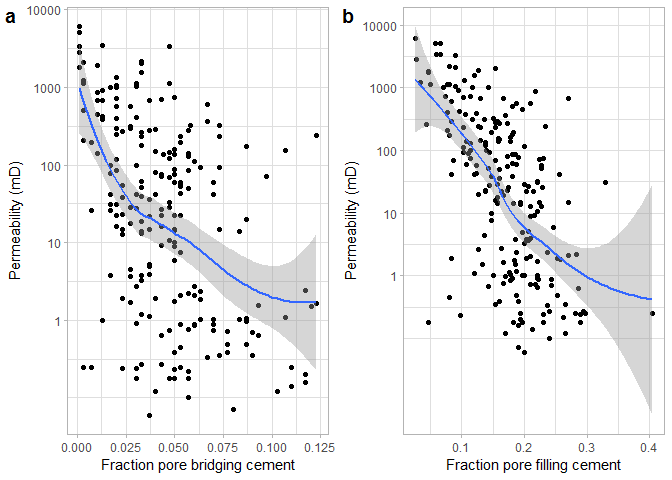

    ##                  CK_void_fraction        P_b        P_f        KLH
    ## CK_void_fraction        1.0000000 -0.4197979 -0.5868664  0.9308890
    ## P_b                    -0.4197979  1.0000000  0.1151770 -0.4736764
    ## P_f                    -0.5868664  0.1151770  1.0000000 -0.6095451
    ## KLH                     0.9308890 -0.4736764 -0.6095451  1.0000000

Ah ha! This matters. Nice, high, Spearman r values showing that pore-filling and pore-bridging cement are bad for permeability. Now, these also happen to be strongly correlated with interparticle porosity and, as one might expect, so the story could be complicated, there. This looks like enough to start setting up a regression. What form should this regression take? Let's take some inspiration from Winland and slightly abuse Panda and Lake's (1995) Carman-Kozeny equation.

After that abuse, the regression equation becomes
Now, to the regressor!

    ## 
    ## Call:
    ## lm(formula = log(KLH) ~ log(CK_void_fraction) + log(P_b) + log(P_f) + 
    ##     log(a_u) + log(tau_e), data = df, na.action = na.exclude)
    ## 
    ## Residuals:
    ##     Min      1Q  Median      3Q     Max 
    ## -3.1513 -0.8064  0.0719  0.7716  3.8951 
    ## 
    ## Coefficients:
    ##                       Estimate Std. Error t value Pr(>|t|)    
    ## (Intercept)            5.01954    1.07582   4.666 5.49e-06 ***
    ## log(CK_void_fraction)  0.62982    0.02597  24.255  < 2e-16 ***
    ## log(P_b)              -0.46819    0.10312  -4.540 9.48e-06 ***
    ## log(P_f)              -0.77252    0.21598  -3.577 0.000432 ***
    ## log(a_u)              -0.11392    0.22681  -0.502 0.616002    
    ## log(tau_e)             0.07359    0.03829   1.922 0.055987 .  
    ## ---
    ## Signif. codes:  0 '***' 0.001 '**' 0.01 '*' 0.05 '.' 0.1 ' ' 1
    ## 
    ## Residual standard error: 1.157 on 209 degrees of freedom
    ## Multiple R-squared:  0.8499, Adjusted R-squared:  0.8463 
    ## F-statistic: 236.7 on 5 and 209 DF,  p-value: < 2.2e-16

    ##      RMSE  Rsquared       MAE 
    ## 1.1410837 0.8499225 0.8866148


Now we're cooking with gas! An R**<sup>2</sup> of 0.87 is nothing to sneeze at. Also, it's the first time we've improved beyond the straight Carman-Kozeny void fraction relation. The one issue is that this assumes a linear relationship between the cementation of various types and the porosity. The solution here is to go to non-parametric fitting. Now, non-parametric fitting is prone to overfitting, so we're going to have to set up some cross-validation. After that, let's perform some recursive feature elimination to figure out which features are really impacting permeability. Then, let's use a gradient boosting regressor on the significant features.

    ## [1] "The predictors are: CK_void_fraction, tau_e, P_f, P_b"

This is not a terribly surprising result. Now, to the gradient boosting regressor to see how it all comes together.

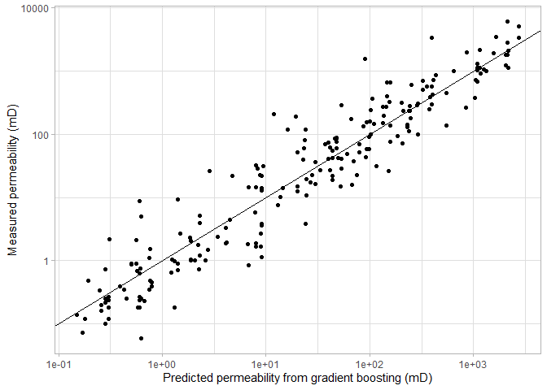

    ##      RMSE  Rsquared       MAE 
    ## 3.3626574 0.7301831 2.9247083

    ##      RMSE  Rsquared       MAE 
    ## 5.2617136 0.5800722 4.9913699

    ## 
    ## Attaching package: 'xgboost'

    ## The following object is masked from 'package:dplyr':
    ## 
    ##     slice

    ## Scale for 'x' is already present. Adding another scale for 'x', which
    ## will replace the existing scale.

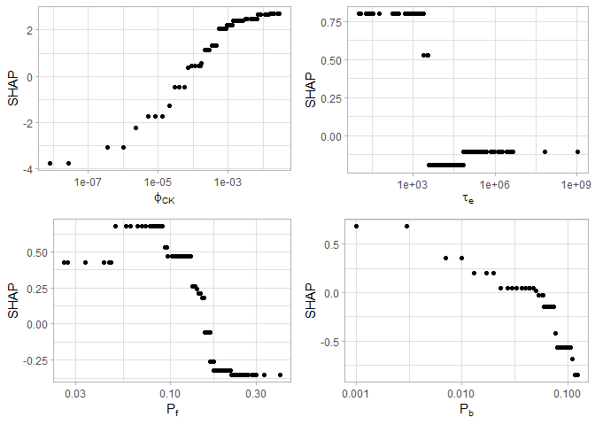

Appendix A
----------

### Derivation of a modified Carman-Kozeny equation for uncemented sandstones

#### Following Panda and Lake (1994)

We start with the Carman-Kozeny equation
where permeability is *k*, porosity is *ϕ*, tortuosity is *τ*, and the specific surface area is *a*. For porosity, we use the porosity to Helium that has been measured on the Garn data. Permeability is air permeability that has been corrected for Klinkenberg effects. In order to measure tortuosity and specific surface area, we have measurements of the median grain size and Trask sorting coefficient, following the approach proposed by Beard and Weyl (1973). Skewness of the distribution of grain sizes can be extracted from these parameters.

Given this information, a modified Carman Kozeny equation following Panda and Lake (1994) is
where $\\bar{D}$ is the mean particle size, *C*<sub>*D*</sub> is the coefficient of varation of the particle size distribution ($C\_D=\\sigma\_D/\\bar{D}$), *γ* is the skewness of the particle size distribution. and *τ*<sub>*u*</sub> is the tortuosity of an unconsolidated, uncemented sand.

Panda and Lake (1994) do not calculate the original tortuosity. However, there has been a wealth of work on this problem in the physics, soil, and petroleum literature. One approach is proposed by Ghanbarian, et al. (2013). This approach makes use of percolation theory and results in tortuosity following a power law with respect to porosity. Taking their equation 8 (which assumes reasonably well-sorted grains and a large system) and plugging in the relevant numbers, original tortuosity follows the equation
Panda and Lake (1995) use a surface area argument to derive the effective tortuosity for an uncemented sandstone of different size particles, which is
<!-- The tortuosity for a sand bed where grain size follows a normal distribution is  -->
<!-- \begin{equation} -->
<!-- \tau_u = 2.5\left(1 + C_D^2 \right). -->
<!-- \end{equation} -->
Next, let's look at the distribution of the distribution measures, $\\bar D,\\ C\_D$, and *γ*: 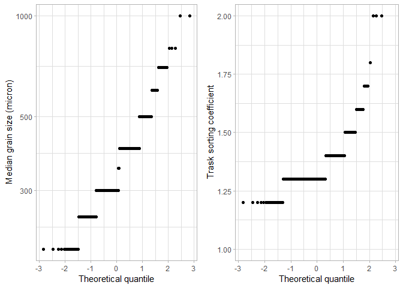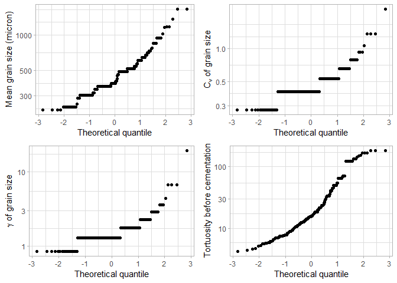

<!-- Now, how well did it work? -->
<!-- ```{r panda_lake_1994, warning=FALSE} -->
<!-- #df <- mutate(df,  -->
<!-- #             k_pl94 = (mean_GS^2 * POR^3)/(72* tortuosity_u) * (gamma_GS * Cv_GS^3 + 3*Cv_GS^2 + 1)^2/(1 + Cv_GS^2)^2) -->
<!-- ggplot(df,aes(x=k_pl94_por, y=KLH) ) + -->
<!--   geom_point() + -->
<!--   geom_smooth(method="rlm", color="steelblue") + -->
<!--   geom_abline(slope=1, intercept=0, color="peru") + -->
<!--   scale_x_log10("Predicted permeability before cementation (mD)", breaks = c(1,10,100,1000,10000, 100000)) + -->
<!--   scale_y_log10("Measured permeability (mD)", limits=c(0.1,2e3), breaks = c(1,10,100,1000,10000))  -->
<!-- ggplot(df,aes(x=k_pl94_impor, y=KLH) ) + -->
<!--   geom_point() + -->
<!--   geom_smooth(method="rlm", color="steelblue") + -->
<!--   geom_abline(slope=1, intercept=0, color="peru") + -->
<!--   scale_x_log10("Predicted permeability before cementation using interparticle macroporosity (mD)") + #, breaks = c(1,10,100,1000,10000, 100000)) + -->
<!--   scale_y_log10("Measured permeability (mD)", limits=c(0.1,2e3), breaks = c(1,10,100,1000,10000))  -->
<!-- summary( -->
<!--   rlm(log(KLH) ~ log(k_pl94_por), df) -->
<!-- ) -->
<!-- cor.test(df$k_pl94_por,df$KLH, method='spearman' )$estimate**2 -->
<!-- ``` -->
Appendix B
----------

### Derivation of Carman-Kozeny corrections for cemented sandstones

#### Following Panda and Lake (1995)

Carman-Kozeny theory does not consider the effect of cementation on permeability, but we know that cement is present in these rocks, and that it blocks flow paths, decreasing the permeability. In terms of the quantities considered by Carman and Kozeny, this changes the tortuosity and the specific surface area. There are several different cements that could be present, and they are measured through point counting. The next figure shows the abundance of each cement.

    ## No id variables; using all as measure variables

    ## Picking joint bandwidth of 0.689

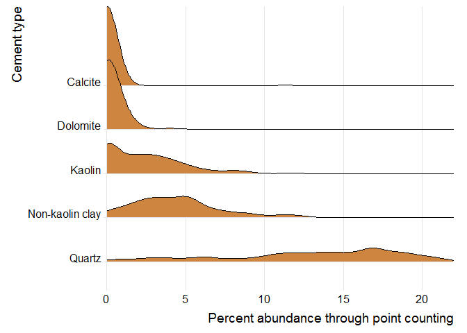

Panda and Lake (1995) separate cement types into three categories: pore-filling, pore-lining, and pore-briding, following Neasham (1997). Where cements associate with the pores depends on the thermodynamic properties of the cementing material. Crystal-like kaolinite and dickite cements are pore-filling. Other pore-filling cements include quartz, feldspar, dolomite, and calcite. These cements affect the porosity, but because they do not affect the pore throats or the pore shape, they have a small effect on permeability.

Pore-lining cements find it energetically favorable to form long crystals that stretch out from the grains. These cements include the non-kaolinite clay minerals, such as chlorite, illite, and smectite. The long crystals affect permeability more than they affect porosity because of the large surface areas they generate.

Pore-bridging cements can partially or completely block the pore throats. This strongly influences the permeability, increasing the tortuosity of the system and decreasing the connectivity. Examples of the minerals that bridge pores include illite, chlorite, and montmorillonite (the non-Kaolin clay minerals).

After cementation, the tortuosity and specific surface area has changed. Panda and Lake (1995) suggest an effective tortuosity, *τ*<sub>*e*</sub>, given by
where *R* is a constant equal to 2 indicating the additional distance traveled by the fluid as a function of the thickness of cementation. The volume fraction of pore-bridging cement is *m*<sub>*b*</sub> = *P*<sub>*b*</sub>(1 − *ϕ*)/*ϕ*, and the volume fraction of pore-filling cement is *m* = *P*<sub>*f*</sub>(1 − *ϕ*)/*ϕ*.

For an unconsolidated sand of variable sizes, the specific surface area is
After cementation, the effective specific surface area follows the equation
where *a*<sub>*u*</sub> is the specific surface area for an unconsolidated, uncemented sand, *ϕ*<sub>*u*</sub> is the porosity of an unconsolidated sand, *a*<sub>*b*</sub> is the specific surface area for a pore-bridging cement, *a*<sub>*f*</sub> is the specific surface area for a pore-filling cement, and *P*<sub>*b*</sub>, *P*<sub>*f*</sub> are the relative fractions of pore-bridging and pore-filling cement, respectively.

Taking these equations together, the equation for permeability becomes
Now, with these calculations, the properties of the grain size distribution measured by Ehrenberg (1990) can be used to test the theory derived by Panda and Lake (1995).

<!-- \begin{align} -->
<!-- k &= \left[\bar{D}^2 \phi^3 \left(3C_D^2 + 1 \right)^2 \right]\\ -->
<!--  &\left\{ 2\tau_e (1-\phi)^2 \left[ 6\left(1+C_D^2 \right) \frac{1-\phi_u}{1-\phi} +\right.\right.\\ -->
<!--  &\left.\left. \left(a_b P_b + a_f P_f \right) \bar{D} \left(3C_D^2 +1 \right) \right]^2\right\}^{-1} -->
<!-- \end{align} -->
First, let's look at the distributions of tortuosity and effective specific surface area.

Appendix C
----------

### Lognormal distribution statistics

Here we relate median grain size and the Trask Sorting Coefficient (*S*<sub>*o*</sub>) to the mean, standard deviation, and skewness of the grain size distribution. From the mean and standard deviation, the coefficient of variation, $C\_v = \\bar{D}/\\sigma$, can be calculated.

Grain size distribution is often described by the median grain size and the Trask Sorting Coefficient (*S*<sub>*o*</sub>), which is defined by $S\_o=\\sqrt{D\_{0.75}/D\_{0.25}}$, where *D*<sub>*p*</sub> is the quantile value indicated by *p*, such that *D*<sub>0.25</sub> is the 25%-ile grain size. Panda (1994, Appendix B) derived an equation relating average grain size, Trask Sorting Coefficient, and the standard deviation of the grain size, which is
This equation is done through *D*<sub>*p*</sub> being calculated in a log<sub>2</sub> space, but most calculations of *S*<sub>*o*</sub> use the definition I provided above, so this should be re-derived.

According to my derivation, assuming lognormality, following a distribution with the PDF
the mean grain size is $\\bar{D} = \\exp(\\mu + \\sigma/2)$, and in terms of the median and Trask sorting coefficient, the parameters of the distribution are
Okay, let's test those stats with a randomly generated lognormal distribution:

``` r
mu <- 3.14159
sigma <- 1
d <- rlnorm(10000, mu, sigma) # distribution of 1k points with mu=10, sigma=1

trask <- sqrt(quantile(d,0.75) / quantile(d,0.25))
d_50 <- median(d)
mu_calc <- log(d_50)
erfinv <- function(x) qnorm((x + 1)/2)/sqrt(2)
sigma_calc <- log(trask) / (sqrt(2) * erfinv(0.5))
mean_calc <- exp(log(d_50) + sigma_calc/2)
exponent_thingie <- (2*sqrt(2) * erfinv(0.5))

cat(
  "\nThe median is", round(median(d),1),
       "It should be", round(exp(mu),1),
      "\nThe mean is",round(mean(d),1),
      "It should be", round(exp(mu + sigma/2),1),
      "\nThe standard deviation is",round(sd(d),1),
      "It should be",round( sqrt( (exp(sigma^2)-1) * exp(2*mu+sigma^2))),
      "\nThe Trask sorting coefficient is",round(sqrt(quantile(d,0.75) / quantile(d,0.25)),2),
  "\nFrom the Trask and median diameters, the mean should be", round(mean_calc,1),"or",
  round(d_50 * trask^(1/(2*sqrt(2) * erfinv(0.5))),1),
  "\nThis is a deviation of", round((exp(mu + sigma/2) - mean_calc)/exp(mu + sigma/2)*100,1),"percent\n"
      
)
```

    ## 
    ## The median is 23.4 It should be 23.1 
    ## The mean is 37.8 It should be 38.2 
    ## The standard deviation is 48.2 It should be 50 
    ## The Trask sorting coefficient is 1.95 
    ## From the Trask and median diameters, the mean should be 38.4 or 38.4 
    ## This is a deviation of -0.6 percent

The mean grain size can be calculated from the median grain size and standard deviation through the equation (assuming a lognormal distribution of the grain size). In addition, the coefficient of variation and skewness can be calculated. The equations for these terms are
ETC
===

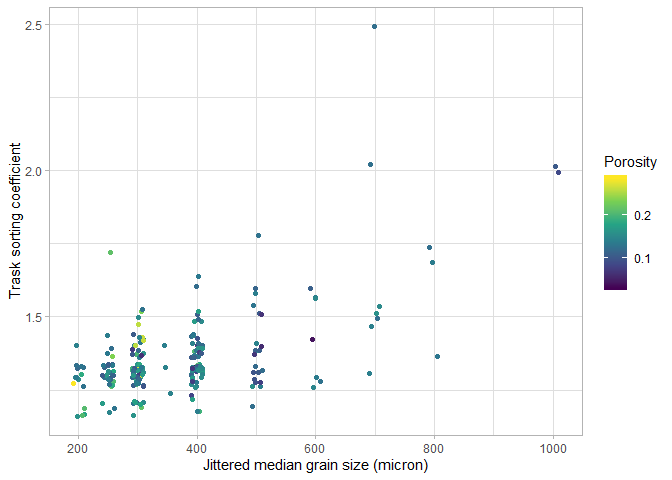

    ## `stat_bin()` using `bins = 30`. Pick better value with `binwidth`.

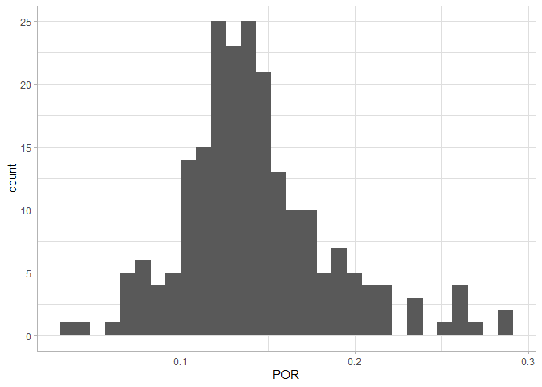

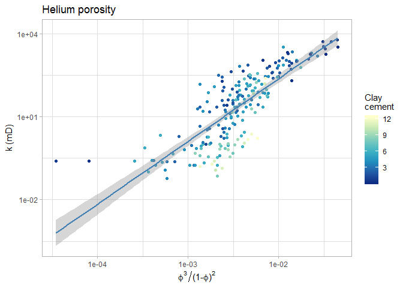

    ## 
    ## Call:
    ## lm(formula = KLH ~ POR^3/(1 - POR)^2, data = df)
    ## 
    ## Residuals:
    ##     Min      1Q  Median      3Q     Max 
    ## -1030.6  -321.9  -128.0   191.1  3731.1 
    ## 
    ## Coefficients:
    ##             Estimate Std. Error t value Pr(>|t|)    
    ## (Intercept)  -1688.4      138.1  -12.22   <2e-16 ***
    ## POR          14199.0      926.1   15.33   <2e-16 ***
    ## ---
    ## Signif. codes:  0 '***' 0.001 '**' 0.01 '*' 0.05 '.' 0.1 ' ' 1
    ## 
    ## Residual standard error: 584.6 on 213 degrees of freedom
    ## Multiple R-squared:  0.5246, Adjusted R-squared:  0.5224 
    ## F-statistic: 235.1 on 1 and 213 DF,  p-value: < 2.2e-16

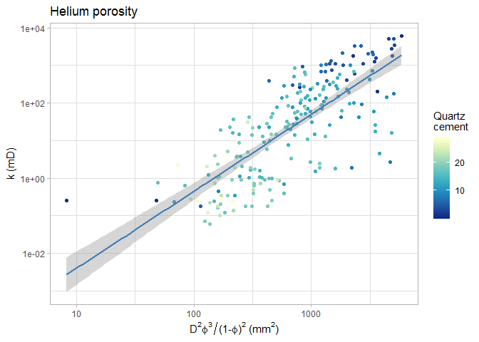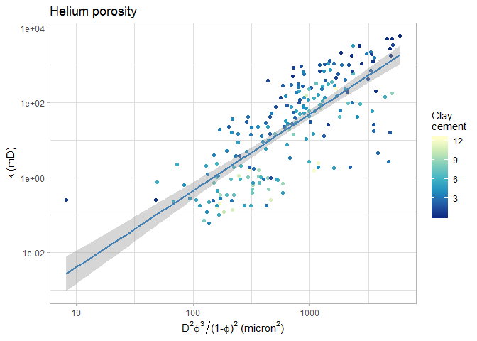

    ## 
    ## Call:
    ## lm(formula = KLH ~ mean_GS^2 * POR^3/(1 - POR)^2, data = df)
    ## 
    ## Residuals:
    ##    Min     1Q Median     3Q    Max 
    ## -924.9 -304.3  -95.5  196.4 3599.4 
    ## 
    ## Coefficients:
    ##               Estimate Std. Error t value Pr(>|t|)    
    ## (Intercept) -2816.2781   364.1172  -7.735 4.20e-13 ***
    ## mean_GS         2.5475     0.7786   3.272  0.00125 ** 
    ## POR         22182.4838  2701.3698   8.212 2.16e-14 ***
    ## mean_GS:POR   -18.6961     6.2068  -3.012  0.00291 ** 
    ## ---
    ## Signif. codes:  0 '***' 0.001 '**' 0.01 '*' 0.05 '.' 0.1 ' ' 1
    ## 
    ## Residual standard error: 572.4 on 211 degrees of freedom
    ## Multiple R-squared:  0.5486, Adjusted R-squared:  0.5422 
    ## F-statistic: 85.49 on 3 and 211 DF,  p-value: < 2.2e-16

    ## 
    ## Call:
    ## lm(formula = KLH ~ GS^2 * POR^3/(1 - POR)^2, data = df)
    ## 
    ## Residuals:
    ##    Min     1Q Median     3Q    Max 
    ## -950.1 -292.3  -78.4  175.1 3591.9 
    ## 
    ## Coefficients:
    ##              Estimate Std. Error t value Pr(>|t|)    
    ## (Intercept) -3282.395    428.431  -7.661 6.57e-13 ***
    ## GS              4.512      1.167   3.865 0.000148 ***
    ## POR         25144.664   3090.141   8.137 3.46e-14 ***
    ## GS:POR        -32.015      8.960  -3.573 0.000437 ***
    ## ---
    ## Signif. codes:  0 '***' 0.001 '**' 0.01 '*' 0.05 '.' 0.1 ' ' 1
    ## 
    ## Residual standard error: 567 on 211 degrees of freedom
    ## Multiple R-squared:  0.557,  Adjusted R-squared:  0.5507 
    ## F-statistic: 88.43 on 3 and 211 DF,  p-value: < 2.2e-16


    ## 
    ## Call:
    ## lm(formula = KLH ~ IMP^3/(1 - IMP)^2, data = mutate(df, IMP = IMP/100))
    ## 
    ## Residuals:
    ##    Min     1Q Median     3Q    Max 
    ## -896.7 -320.2  -11.7  258.0 3582.9 
    ## 
    ## Coefficients:
    ##             Estimate Std. Error t value Pr(>|t|)    
    ## (Intercept)  -375.27      56.98  -6.586 3.48e-10 ***
    ## IMP         11742.47     699.04  16.798  < 2e-16 ***
    ## ---
    ## Signif. codes:  0 '***' 0.001 '**' 0.01 '*' 0.05 '.' 0.1 ' ' 1
    ## 
    ## Residual standard error: 556.1 on 213 degrees of freedom
    ## Multiple R-squared:  0.5698, Adjusted R-squared:  0.5678 
    ## F-statistic: 282.2 on 1 and 213 DF,  p-value: < 2.2e-16

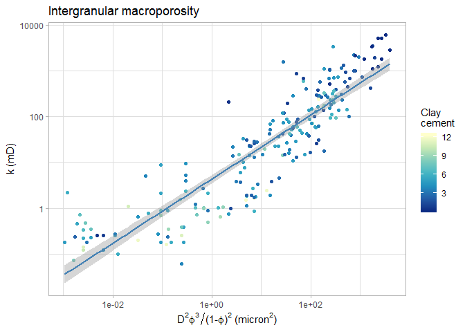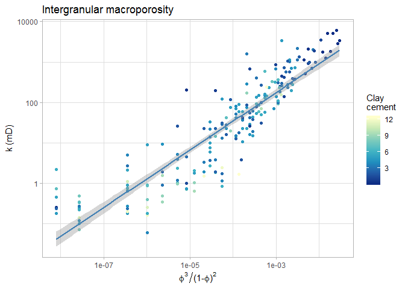

    ## 
    ## Call:
    ## lm(formula = KLH ~ mean_GS^2 * IMP^3/(1 - IMP)^2, data = mutate(df, 
    ##     IMP = IMP/100))
    ## 
    ## Residuals:
    ##     Min      1Q  Median      3Q     Max 
    ## -1092.5  -277.2   -15.1   227.9  3510.4 
    ## 
    ## Coefficients:
    ##               Estimate Std. Error t value Pr(>|t|)    
    ## (Intercept)  -504.0130   126.0618  -3.998 8.83e-05 ***
    ## mean_GS         0.3472     0.2499   1.390   0.1661    
    ## IMP         16023.1146  2002.5738   8.001 8.09e-14 ***
    ## mean_GS:IMP   -10.9041     4.7369  -2.302   0.0223 *  
    ## ---
    ## Signif. codes:  0 '***' 0.001 '**' 0.01 '*' 0.05 '.' 0.1 ' ' 1
    ## 
    ## Residual standard error: 551.7 on 211 degrees of freedom
    ## Multiple R-squared:  0.5807, Adjusted R-squared:  0.5747 
    ## F-statistic:  97.4 on 3 and 211 DF,  p-value: < 2.2e-16

    ## 
    ## Call:
    ## lm(formula = KLH ~ GS^2 * IMP^3/(1 - IMP)^2, data = mutate(df, 
    ##     IMP = IMP/100))
    ## 
    ## Residuals:
    ##     Min      1Q  Median      3Q     Max 
    ## -1081.6  -274.5    -5.4   217.5  3535.0 
    ## 
    ## Coefficients:
    ##               Estimate Std. Error t value Pr(>|t|)    
    ## (Intercept)  -531.8282   156.7496  -3.393 0.000826 ***
    ## GS              0.5262     0.4137   1.272 0.204739    
    ## IMP         16535.3395  2263.9842   7.304 5.65e-12 ***
    ## GS:IMP        -15.3380     6.8062  -2.254 0.025252 *  
    ## ---
    ## Signif. codes:  0 '***' 0.001 '**' 0.01 '*' 0.05 '.' 0.1 ' ' 1
    ## 
    ## Residual standard error: 551.7 on 211 degrees of freedom
    ## Multiple R-squared:  0.5807, Adjusted R-squared:  0.5747 
    ## F-statistic: 97.41 on 3 and 211 DF,  p-value: < 2.2e-16
