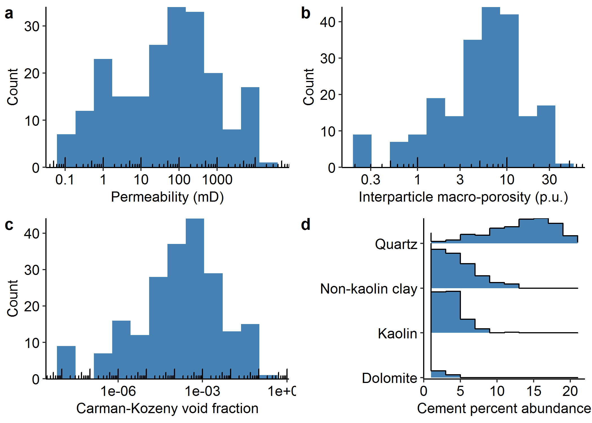
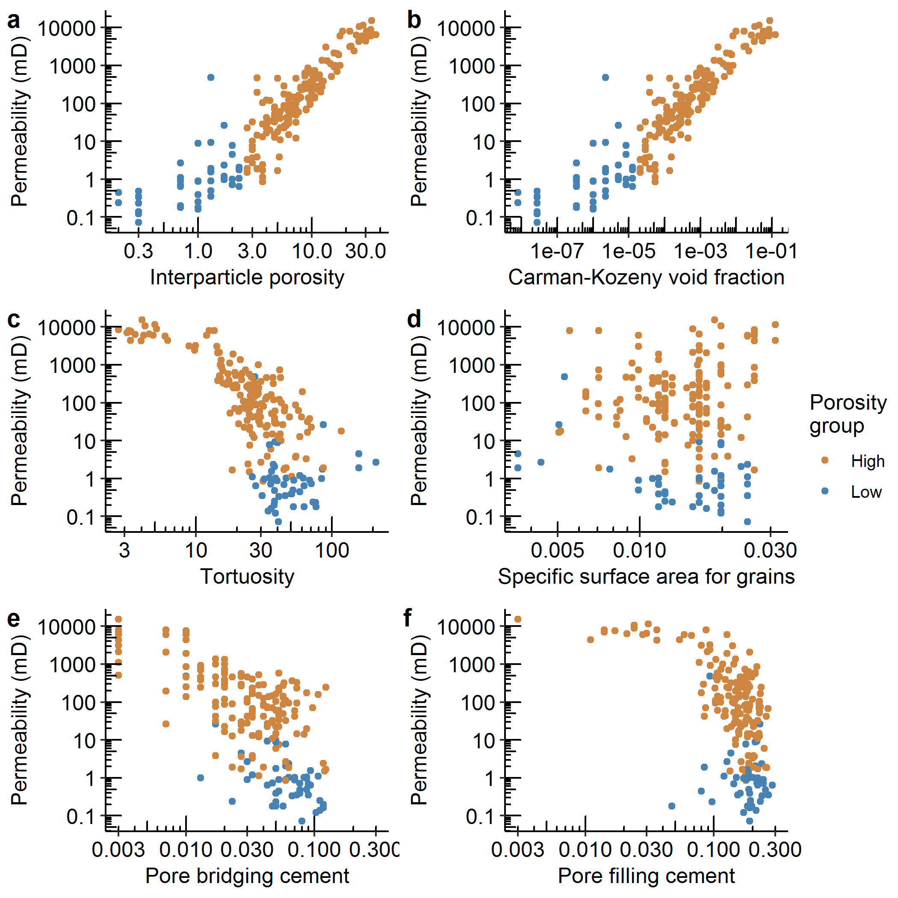
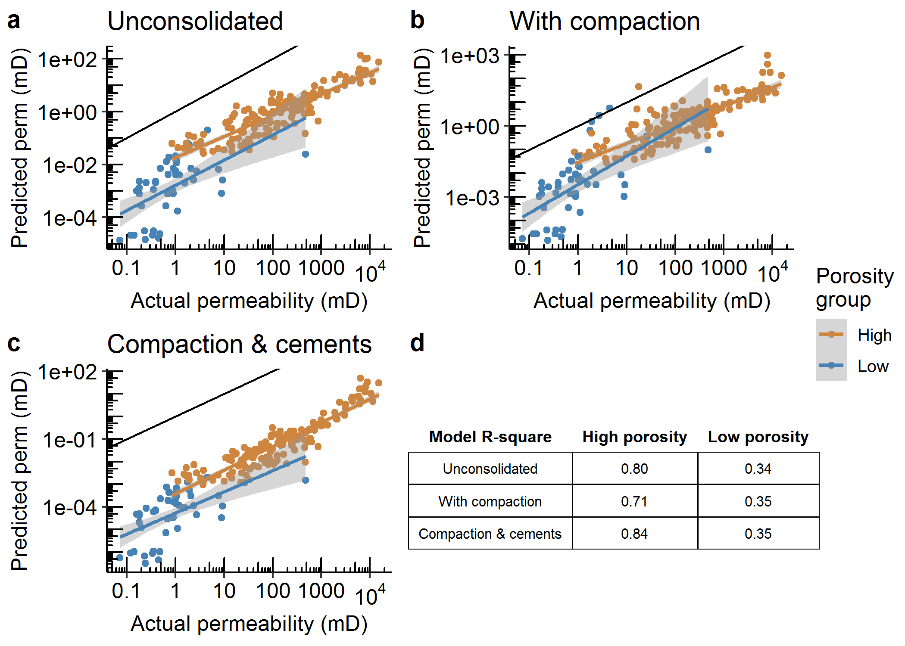
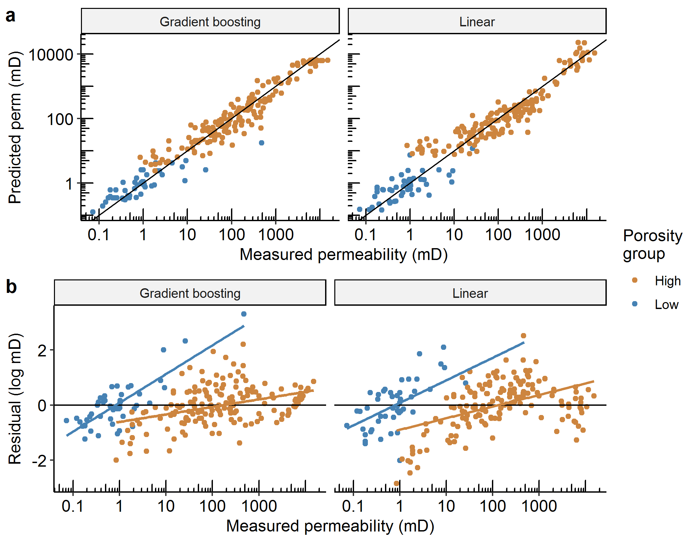
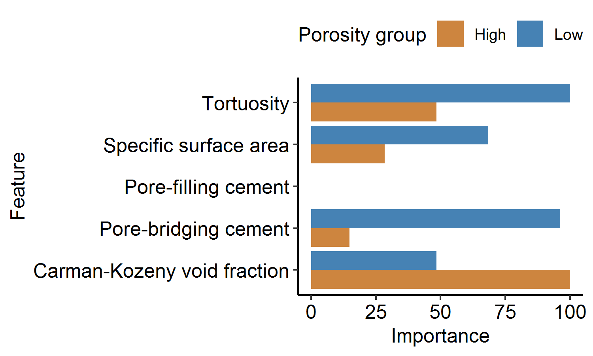
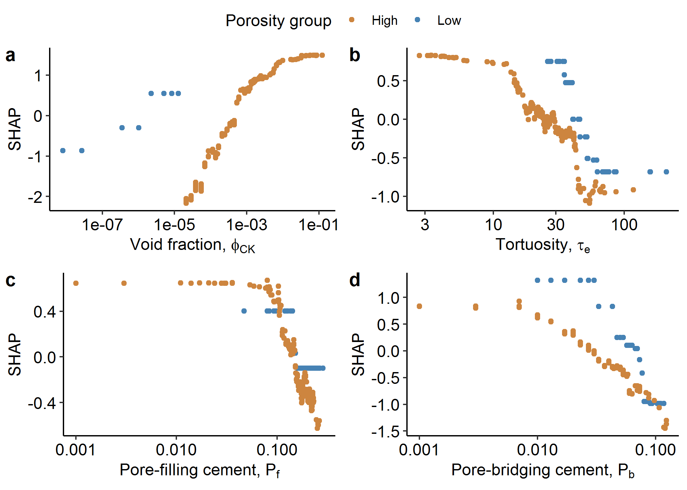
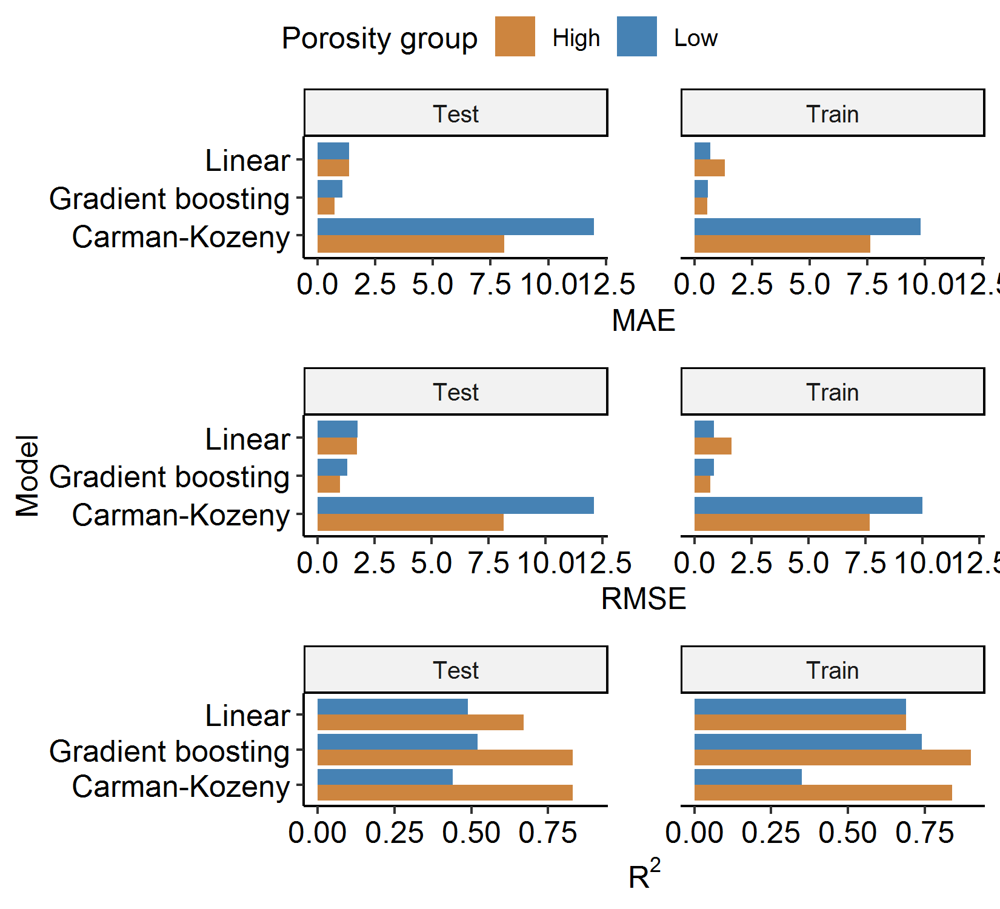
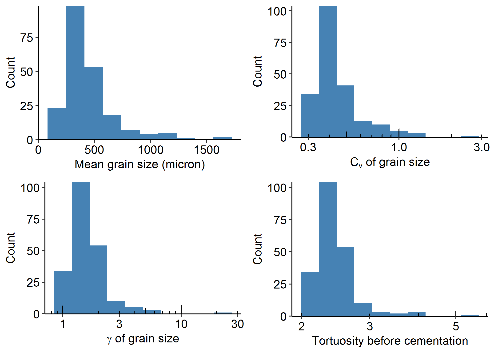

# Abstract
Permeability prediction has been an important problem since the time of Darcy. Most approaches to solve this problem have used either idealized physical models or empirical relations. In recent years, machine learning (ML) has led to more accurate and robust, but less interpretable empirical models. Using 211 core samples collected from 12 wells in the Garn Sandstone from the North Sea, this study compared idealized physical models based on the Carman-Kozeny equation to interpretable ML models. We found that ML models trained on estimates of physical properties are more accurate than physical models. Also, the results show evidence of a threshold of about 10% volume fraction, above which pore-filling cement strongly affects permeability.  
  
#Introduction
Sandstone is one of the most common types of reservoir rocks, contributing approximately 30% to the stratigraphic  total of sedimentary rocks (Pettijohn, 1975). It is the lithology for eight of the ten largest gas fields in the world (Walsh and Lake, 2003; Sandrea, 2005). Therefore, it is of interest to predict the reservoir properties of sandstones. This paper will focus on analyzing the factors that influence sandstone permeability.  
  
At least two broad approaches are available for permeability prediction of sandstones: 1) physics-based models, such as the Carman-Kozeny equation and its derivatives, and 2) empirical models, developed using statistical or machine learning (ML) tools that assume no particular physical laws linking predictors and permeability. There are several physics-based and empirical models; Dullien (2012) gives a good review of both model types. This study included a hybrid approach that considers both the physical intuition encapsulated in the Carman-Kozeny equation and data-centric models. The novelty of this work is that it compares the results of the physics-only and physics plus data driven models.  
  
Kozeny (1927) and Carman (1937) developed an equation linking permeability to three factors: porosity, hydraulic tortuosity, and specific surface area. Porosity and permeability are routinely measured during core analysis, but hydraulic tortuosity (as opposed to electrical tortuosity) and specific surface area are rarely evaluated although some log-derived quantities are surrogates for this. However, both tortuosity and specific surface area arise from geologic processes that can be modeled and distributed throughout the reservoir. Therefore, understanding the magnitude and effect of tortuosity and surface area can aid in building accurate permeability predictors and applying these predictions in geomodels.  
  
Panda and Lake (1995) developed a mathematical framework for estimating tortuosity and specific surface area for real rocks that had undergone diagenesis. The framework, can predict permeability from the intergranular porosity, the average grain diameter, the grain size distribution, and the amounts and types of various cements.  
  
Machine learning can be used to understand how useful tortuosity and specific surface area are for predicting permeability. With advanced non-parametric ML (such as the gradient boosting machine developed by Friedman, 2001), there is no requirement to assume _a priori_ a functional form between these variables and the predicted quantity. With the recent derivation of a consistent feature attribution system for explaining tree-based models (Lundberg et al., 2018), the functional form can be visualized after modeling; this may help petrophysicists to understand the mechanisms controlling permeability.  
  
In this study, we develop estimates for the permeability of the Garn Sandstone reservoir (Ehrenberg, 1990), using the data from the 12 wells in that study. The Garn is a Middle Jurassic formation in the North Sea, in the Haltenbanken area (Ehrenberg, 1990) that was deposited in fluvial and near-shore marine environments (Gjelberg et al., 1987).  It is composed mostly of quartz grains and secondarily with feldspar (Ehrenberg, 1990).  
  
This study compared different methods for calculating the tortuosity and specific surface area from core description and found the most important determinants of permeability predictors for this data. Our analysis shows that porosity best predicts permeability, followed by the presence of pore bridging cement and then tortuosity. Given the physics-based model and advanced ML estimators, we propose a hybrid approach, combining the best qualities of each method.  

# Methods
## Physical models
Perhaps the best-known physics-based relationship to estimate permeability was developed by Kozeny (1927) and later modified by Carman (1937). In its modern form, the equation is written as
$$k = \frac{\phi^3}{2\tau(1-\phi)^2 a^2},$$
which, for simplicity, we will write as
$$k = \frac{\phi_{CK}}{2\tau a^2},$$
where  permeability is $k$,  porosity is $\phi$, tortuosity is $\tau$, the specific surface area (wetted area/volume) is $a$, and the Carman-Kozeny void fraction is $\phi_{CK}$. For an uncemented sandstone, tortuosity can be calculated following the derivation in Appendix A, which comes from Panda and Lake (1994). For a cemented sandstone (Appendix B), the tortuosity changes because of cements blocking and forcing modification of the flow paths.  
  
For monodisperse spheres, $a=6/d$, where $d$ is the sphere diameter. For uncemented spheres of more than one size, $a$ can be estimated from the particle size distribution (sorting) (Panda and Lake, 1994). After cementation, the cement distribution is a further control on how the surface area changes. Some cements will coat the pores walls, slightly decreasing the specific surface area. Other cements will line or bridge the pores, moderately to greatly increasing the specific surface area.   
  
A different model is based on the idea that pore throat sizes are an important variable in permeability models. This hypothesis is implicit in the Winland-style relations that follow the form
$$\ln r = A \ln k - B \ln \phi + C$$
 
where $r$ is the pore throat radius (see Kolodzie, 1980; Di and Jensen, 2015). <!--Winland’s work focused on predicting pore throat radius (and therefore two-phase fluid flow properties) from permeability and porosity but, a several investigators have reversed the roles of the predictor and response variables in the equation to predict permeability from pore throat size and porosity (e.g., Ghanbarian et al., 2019; Ngo et al., 2015; and Comisky et al., 2007).  -->  
  
Doyen (1988) formalized this approach, applying effective medium theory to explain permeability with the equation  
$$k =  \frac{\phi}{8\tau}  \frac{r_{eff}^4}{\langle r_t^2\rangle}$$
where $r_{eff}$ is the effective pore throat radius and $\langle r_t^2\rangle$ is the spatial average of the square of the pore channel radii. This result is remarkably similar to the Carman-Kozeny equation, except that the dependency on specific surface area has been replaced with a dependency on the pore throat radii.  
  
As a practical consideration, the pore throat radius might be more impacted by cements that coat the walls than cements that bridge the pores. However, the opposite is true for the specific surface area (Scheidegger, 1960).

## Data-driven models
Empirical models have long been important in reservoir engineering (see Frick, 1962 for numerous examples). These models, such as Winland’s equation  (Kolodzie, 1980), seek out relationships between predictor variables (independent variables) and responses (dependent variables – here, permeability). In the last two decades, advances in applied statistics and computing power have created new approaches for developing empirical relationships. This has spawned the field of data analytics and the attendant study of ML.  
  
The data analytics approach is as follows:  
1. collect and clean data  
2. propose physics-based predictor variables   
3. perform exploratory analysis  
4. build machine learning models on a subset of the data (training data)  
5. evaluate the machine learning models on new data (testing data)  
6. interpret model results.  
  
We apply the above workflow to data from Ehrenberg (1990). This dataset has a large range of permeability and porosity, cement proportions are measured, and it requires only minimal cleaning. However, the data lacks many of the variables in the Carman-Kozeny equation. Therefore, we performed feature engineering to derive these variables from Ehrenberg’s measurements. Among the variables the data did not have were the mean particle size, the coefficient of variation of the particle size, and the skewness of the particle size distribution. These variables were derived through the procedure given in Appendix C.  
  
During exploratory data analysis, we plot the distributions of predictor and response variables and make cross-plots between variable pairs to identify predictor variables with strong co-linearity   and with strong correlation to the response variable. For the Garn sandstone, the predictor variables include the porosity, the Carman-Kozeny void fraction, the Carman-Kozeny predictions of permeability, and the volume fractions of pore-filling and pore-bridging cement present.  
  
Ehrenberg (1990) estimated porosity two ways: Helium porosimetry, and point counting the intergranular macroporosity of thin sections. These measurements are highly correlated, so including both in the regression model could cause overfitting and overestimate the influence of porosity on the permeability (feature importance would be split between the two porosity measures). Therefore, we chose to use a single porosity estimate. Exploratory data analysis showed that intergranular macroporosity was a better predictor of permeability than Helium porosity, and we chose it for the model.  
  
This study includes two approaches to building the models: multiple linear regression and gradient boosting regression (Friedman, 2001). Multiple linear regressions are common, easily interpretable, and robust to overfitting. These regressions also make several assumptions that are often violated in real data sets, including a linear model relating predictors and response variables, Gaussian distributions, and homoscedastic residuals. Gradient boosting regressors make fewer assumptions about the distributions of the input data and the character of the relationship between predictor variables and the response, but their results are difficult to interpret and prone to overfitting. To illustrate the benefits and drawbacks of these approaches, we use both methods and compare the results.  
  
Through careful feature selection and pre-processing, we limited the degree to which the assumptions in linear regression are violated. As aforementioned, one of those steps is removing highly correlated predictor variables. In addition, we log-transformed the predictor variables and permeability, which reduces non-normality of the variables’ distributions. Log-transformation also makes the correlations between variables more linear. Using the Box-Cox (1964) transformation did not significantly improve the results, but it can be effective in some cases, as shown by Jensen et al. (1987).)  
  
We evaluated the models through calculating the model explained variance (R^2^), mean absolute error (MAE), and root-mean squared error (RMSE). The equations for these measures are as follows  
$$\begin{align}
R &= \frac{1}{n-1} \sum_i^n \frac{y_i - \bar{y}}{\sigma_y}\frac{y'_i - \bar{y'}}{\sigma_{y'}} \\
\text{RMSE} &= \left(\frac1n \sum_i^n \left(y_i - y_i'\right)^2 \right)^{1/2} \\
\text{MAE} &= \frac1n \sum_i^n \left|y_i - y_i'\right|
\end{align}$$
where $n$ is the sample size $i$ represents the sample number, $y$ is the actual value, $y'$ is the predicted value, a bar over a quantity is the sample mean of that quantity, and $\sigma$ is the sample standard deviation of a quantity. 

Hyperparameters for the gradient boosting regressor were selected through cross-validation. During cross-validation, candidate models are fed data on seven of the eight wells in the training data, then scored based on which minimizes the RMSE predicting the excluded well. This is iterated through each well and a gamut of hyperparameters. Through this procedure, we maximize the model effectiveness while reducing overfitting by minimizing the validation RMSE on held-out data (four wells in the testing data).  
  
In order to determine whether predictor variables contributed to the result, we used a non-parametric approach. This approach is called Permutation Feature Importance (Fisher, et al., 2018), and estimates the importance of a predictor variable based on how much the model error increases after that variable is permutated (randomly shuffled).  

Linear models can be interpreted simply through examining the weight assigned to each predictor (feature). Gradient boosting methods require a different approach. SHapley Additive exPlanations (SHAP values) offer a way to explain how each predictor variable contributed to each prediction (Lundberg and Lee, 2017).  The idea behind Shapley values is to determine how much each input affects the output for each individual prediction. To do this, SHAP values use an idea borrowed from cooperative game theory (Shapley, 1953), where the actors work together as a team to achieve a result, leading to a pay-out proportional to how much each actor contributed to the final result. We use an exact solution for SHAP values (Lundberg and Lee, 2017) that has been implemented in the XGBoost library (Chen and Guestrin, 2016).  
  
# Results and Discussion
## Exploratory analysis
First, we examined the distributions for porosity, permeability, Carman-Kozeny void fraction, and the proportion of various cements (Fig. 1). The permeability, porosity—and therefore Carman-Kozeny void fraction—distributions follow a bi-modal distribution. The permeability histogram is the most clearly bi-modal (modes of approximately 0.8 and 90 md) of the three parameters, but a minor mode also exists in the porosity histograms ($\log\phi$ modes at approximately 1.8 and 6 pu). Multimodal distributions are common in subsurface data and can be indicative of multiple facies (Jensen et al., 2000). An appropriate treatment of bi-modal data is to analyze each mode separately, splitting the analysis into high porosity and low porosity assessments.  
  
Therefore, when we performed regressions on the data, we treated each mode separately, rather than regressing across the entirety of the data. The data was split into two classes: samples where the interparticle macro-porosity is greater than 2.3% (high) or less than or equal to 2.3% (low). The cutoff was selected through using Gaussian Mixture Modeling (Fraley and Raftery, 2002) to separate the modes..  
  
There are 163 points in the high porosity training set, 41 points in the high porosity testing set, 48 points in the low porosity training set, and 20 points in the low porosity testing set.

<!-- -->

Figure 1. Histograms for the distributions of a) Klinkenberg-corrected absolute permeability b) interparticle macro-porosity from point-counting c) Carman-Kozeny void fraction from macro-porosity d) Percent abundances (total area fraction) of cement. The permeability and porosity, both log-transformed, follow bimodal distributions. Quartz is the most abundant cement, followed by non-kaolin clay (smectite and illite).  
  
Next, we cross-plotted permeability against several individual predictors (Fig. 2): Carman-Kozeny void fraction, tortuosity, pre-cementation specific surface area, and fraction of pore-bridging and pore-filling cement. Pore-filling cement includes quartz, kaolin clay, and dolomite, and pore-bridging cement is non-kaolin clay.  
<!-- -->

Figure 2. Cross-plots between permeability and several predictor variables. These variables include a) the interparticle macro-porosity b) the Carman-Kozeny void fraction, c) tortuosity as calculated in Panda and Lake (1995), d) specific surface area in reciprocal square microns for the grains (pre-cementation), e) fraction of pore-bridging cement f) fraction of pore-filling cement. The color indicates whether the sample has greater than 2.3 percent porosity (orange) or not (blue).  
  
To assign values to the correspondence between the predictor variables and permeability, we calculated the Pearson’s r and Kendall tau values (Table 1). Both statistics measure the degree of association between the variables and have values between -1 and 1. Pearson’s statistic is a measure of linear correlation and based on the data values; Kendall’s statistic is based on the ranks of the data values. More details can be found in many statistics texts, including Miller (1986).  
  
Table 1. Pearson r and Kendall tau values for correlation between log-transformed predictor variables and log permeability. The data is split between modes of the porosity distribution, based on whether or not the porosity is greater than 2.3. Tortuosity is calculated after taking cementation into account; specific surface area is calculated without including cementation – making the presence of pore-bridging and pore-filling cements into proxies for specific surface area.

Porosity group   Correlation    Carman-Kozeny void fraction   Tortuosity   Specific surface area   Pore-bridging cement   Pore-filling cement
---------------  ------------  ----------------------------  -----------  ----------------------  ---------------------  --------------------
High             Pearson r                             0.90        -0.77                    0.18                  -0.71                 -0.63
High             Kendall tau                           0.73        -0.57                    0.11                  -0.46                 -0.40
Low              Pearson r                             0.48         0.06                   -0.42                  -0.59                 -0.09
Low              Kendall tau                           0.44         0.02                   -0.15                  -0.31                 -0.06

The two correlation measures show similar values within each porosity group, however they take on different values between the porosity groups, with less correlation at low porosity. Porosity is the most strongly correlated with permeability, with cements next, and tortuosity and specific surface area having the weakest correlations.

## Model results
This study tested the accuracies and correlations between the physics-based and regression-based models and the measured permeability. The three physics-based models of increasing complexity are:  
1. Classic Carman-Kozeny model with no compaction or cementation effects  
2. Carman-Kozeny model with the effect of compaction on the grain size distribution  
3. Carman-Kozeny including compaction and cement's effect on tortuosity   
  
The results from these models of increasing complexity are shown in Fig. 3.

<!-- -->

Figure 3. Comparisons of physics-based models to measured permeability. The black line indicates perfect agreement. The colored lines are least-squares best fits. Shading indicates 95% uncertainty in the best fit line. a) Uses the Carman-Kozeny void fraction and the initial tortuosity and specific surface area expected from an uncompacted particle assemblage of the measured porosity and grain size. b) Considers compaction with the Panda-Lake (1994) model. c) Considers the impact of compaction and the effect of cementation on the tortuosity, following the Panda-Lake (1995) model. d) R^2^ for the log-permeability predicted by these models compared to observed in the core.  
  
Including compaction and cementation modestly improves the Carman-Kozeny model R^2^ by 0.05 for the high porosity sandstone, but weakly for low porosity samples (Fig 3d). High porosity samples are better predicted than low porosity samples. All sample permeabilities are significantly underpredicted by approximately two to three orders of magnitude by the physics-based models, which have no fitting parameters.
  
In addition to the three physics-based models, we tested two physics-inspired, regression-based models (Fig. 4):  
4. A linear model using a Winland-style equation of the form
$$\ln k \propto \ln \phi_{CK} + \ln a_u + \ln \tau_e + \ln P_b + \ln P_f, $$  
5. A gradient boosting model using the same predictor variables, but assuming no particular functional form between the variables and permeability


<!-- -->

Figure 4. a) Predicted versus measured permeability using the linear and gradient boosting models. b) Residuals in the predictions for the linear and gradient boosting models. Color indicates whether the sample is in the high (greater than 2.3%) or low porosity group. Lines indicate the trends in the residual.  
  
The XGBoost hyperparameters that best match permeability for low porosity rock are 520 trees, a learning rate of 0.02, no minimum loss reduction (gamma), a max tree depth of 1, 0.78 of the columns sampled by each tree, and a minimum child weight of 7 samples. For the high porosity rock, they were 550 trees, a learning rate of 0.017, a maximum tree depth of 2, a minimum loss reduction of 0.94, 0.69 of the columns sampled by each tree, a minimum child weight of 2, and a subsample ratio of 0.23 for the training instances.  
  
The linear model Elastic net hyperparameters that best match permeability for low porosity samples cause no regularization. For high porosity samples, the hyperparameters are a regularization constant of 0.15 and an alpha of 0.02, indicating primarily ridge style regression.  
  
As perhaps best shown by the residuals and best fit lines (Fig. 4b), neither model is explaining all the permeability variation with the chosen predictors and models. That is to say, there is a functional relationship between the residual values of the prediction and the value of the permeability. Fig. 4a gradient boosting shows no predictions above 5220 md, a result of the minimum number of points allowed in each split of the gradient boosting trees. Fig. 4b shows that residuals follow a quadratic function at high porosity, indicating a higher-order (than linear) relationship between one or more of the predictors and permeability.

<!-- -->

Figure 5. Feature importance for the linear model. Color indicates whether the model was trained on high (greater than 2.3%) or low porosity samples. No bar indicates that the regularization procedure caused the weight for that feature to reach zero.  

The linear model shows different features are important for high versus low porosity samples (Fig. 5). Carman-Kozeny void fraction is the most important factor for high porosity rock, followed by tortuosity and specific surface area. For low porosity samples, tortuosity and the fraction of pore-bridging cement are the most important features. In neither group is the fraction of pore-filling cement an important feature, both models assign it zero weight (i.e., it does not directly influence permeability).

<!-- -->

Figure 6 . Feature importance for the gradient boosting model, using SHapely Additive exPlananations   (SHAP). SHAP values use game theory to explain how much each element contributes to each prediction from the gradient boosting model. Orange dots show high porosity samples, while blue samples indicate low porosity samples. The SHAP values are for the following features: a) Carman-Kozeny void fraction b) Tortuosity c) volume fraction of pore-filling cement d) volume fraction of pore-bridging cement.  

For the gradient boosting model (Fig. 6), each dot represents the importance for a particular sample. A zero SHAP value indicates no influence of the chosen predictor on the permeability for that sample.  The largest influence on permeability comes from void fraction for high porosity samples, and the fraction of pore-bridging cement for the low porosity samples. Tortuosity and the fraction of pore-filling cement are of secondary importance, and the specific surface area (before cementation) is least important.  
  
The SHAP values for pore filling cement concentration follow a sharply sigmoidal shape, implying a transition point around 10% cementation. Other features show more samples in their linear trend, with the effects of extreme points leveling off because of limited data.  
  
Table 2. Measures of model fitness for the gradient boosting, linear, and advanced Carman-Kozeny models on the high porosity and low porosity groups for the training and testing data.


Model               Porosity group   Data      RMSE     MAE   R^2^
------------------  ---------------  ------  ------  ------  -----
Gradient boosting   Low              Train     0.85    0.59   0.74
Gradient boosting   Low              Test      1.31    1.07   0.52
Gradient boosting   High             Train     0.71    0.55   0.90
Gradient boosting   High             Test      0.97    0.72   0.83
Linear              Low              Train     0.85    0.68   0.69
Linear              Low              Test      1.74    1.35   0.49
Linear              High             Train     1.64    1.33   0.69
Linear              High             Test      1.73    1.37   0.67
Carman-Kozeny       High             Train     7.70    7.63   0.84
Carman-Kozeny       Low              Train    10.00    9.81   0.35
Carman-Kozeny       High             Test      8.17    8.08   0.83
Carman-Kozeny       Low              Test     12.13   11.99   0.44

<!-- -->

Figure 7. Comparison of the root-mean-squared errors for each model. The testing errors are on the right, and the training errors are on the left. The gradient boosting model shows the smallest errors, followed by the linear Winland-style model. The advanced Carman-Kozeny model has the largest errors. Color indicates whether the porosity is above or below the cutoff.  
  
The model metrics (Table 2) indicate that the gradient boosting method leads to smaller residuals and a higher R^2^ than the linear model. This is clearly illustrated in the RMSE plot in Figure 7. For most cases, the models work better on cross-validation training data than testing data. For comparison, a porosity-only log-linear model has R^2^=0.81 for high porosity, 0.23 for low porosity. The gradient boosting model has better explanatory value than porosity alone, while the linear model has roughly the same explanatory value. Both models outperform the porosity-only model at low porosity. They also significantly outperform the physics-based models at low porosity.  
  
Paired t-tests were performed on the residuals for each model for the training and testing data. The null hypothesis was accepted that gradient boosting and linear models did not differ statistically significantly on the low porosity data. At high porosity, the alternative hypothesis was accepted that gradient boosting model performed better in both RMSE and MAE, for both the training and testing data sets, with p-values less than 0.01.

# Discussion

We have presented several methods for estimating permeability from thin section data for sandstone samples. First, we used several physics-based models of increasing complexity. Then, we built hybrid data-driven models with physical parameters as inputs. The data-driven models performed better than the purely physics-based models.  
  
A key step in this analysis is splitting the data into two parts, each containing one mode of porosity. Why have we done this? During exploratory analysis, we saw that the permeability distribution was bi-modal, and the porosity distribution did not match either a normal or a log-normal distribution. Multi-modal permeability distributions are a common problem in permeability modeling (see, _e.g._ Clarke, 1979; Dutton and Willis, 1998; and Jensen et al., 2000). One approach for treating multiple modes is to split the distribution by mode and analyze each separately.   This approach is particularly useful for reservoirs, where identifying the causes for high permeability zones is important, and the magnitude of low permeability zones may be less important.  The splits can be selected through visual inspection, Gaussian Mixture Models (Fraley and Raftery, 2002), or k-means clustering (Likas et al., 2003).Gaussian Mixture Models were used in this study.  
  
The next step of the exploratory analysis is summarized in Table 1. Consistent with many other studies (e.g., Amyx et al., 1960; Slatt, 2006; Doveton, 2014; Baker et al., 2015), we see that porosity has a strong correlation with permeability for the larger-porosity data. There is, however, little to no correlation for low permeability rock, similar to patterns observed elsewhere (e.g., Broger et al., 1997, their Fig. 10; Wendt et al., 1986, their Figs. 2 and 7). In fact, no single parameter correlates strongly with permeability for the low-porosity samples. The Pearson and Kendall correlations are informative, but determining true feature importances requires interrogating a regression model.  
  
Physics-based models based on successively more complex modifications of the Carman-Kozeny equation were tested on the data. We found that including the effect of compaction on the flow properties was not sufficient to improve the model without including cementation. This is in contrast to the findings of Panda and Lake (1994), but consistent with their later work (Panda and Lake, 1995), which included cementation.  
  
Two ML-based models were trained and tested on the data. The Winland-style linear model was the less accurate of the two, but it still provided insights into the relative importance of different physical effects on permeability. The gradient boosting model was more accurate overall and showed a nonlinear effect coming from cementation. However, in a relatively low data environment it loses some resolution in the predictions at the extremes of high and low permeability (see Fig 4a, the top 10 permeability points). The benefits of using the linear model were 1) The model is relatively simple with few parameters to evaluate; 2) the permeabilities above 5000 md were better predicted than with the gradient boosting model. The gradient boosting model, however, could be used with SHAP evaluations to identify control strengths for each sample. This option could be quite useful in other cases if geological information were also available. For example, one might look for changes in the strengths of the predictor variables according to the facies from which the sample was taken.  
  
All of the models tested performed worse at predicting permeability at low porosity. This is likely because of the higher tortuosity and specific surface areas, more cementation, and smaller pore throats at this porosity range. Alternatively, we might have failed to measure an important permeability predictor.  
  
The physics-based model performed worse than the data analysis based models by most metrics, but this does not mean it is without use. Although the absolute values of permeability are severely underestimated, the R2 show good agreement at high permeability, better than the Winland model (Table 2). Considering that the Winland model uses the Carman-Kozeny equation components as its input, this could indicate overfitting for that particular regression. Overfitting is endemic to all empirical models, and although it can be minimized through cross-validation and test-training splits, it cannot be removed without introducing bias to the results. See Breiman (1996) for discussion on bias and variance in data analysis.  
  
There has been healthy debate on whether Doyen’s (1988) pore throat size based approach or Panda and Lake’s (1995) specific surface area approach tell us more about the permeability of sandstones. After building and interpreting two machine learning models, this study can now shed some light on the question.  
  
The feature importances from the logarithmic regression provide evidence that pore throat size is more important than specific surface area in determining permeability. On the other hand, the degree of pore-filling cement present is not important. This recommends measuring pore throat sizes over determining specific surface area.  
  
From the gradient boosting model, we see that specific surface area is less important than void fraction, tortuosity, and the degree of cementation. However, this measure of specific surface area does not include the cementation effect because Panda and Lake did not provide values for calculating surface area from the amount of pore-filling and pore-bridging cement. We see from the SHAP values (Figure 6) that this could be a strong effect following a sigmoidal functional form.  
  
This is, to our knowledge, the first study using SHAP values to interpret machine learning results in predicting permeability. Erofeev, et al (2019) used gradient boosting regressors to predict permeability, but only used F scores to find the most important parameters and did not attempt to determine the functional dependence for each feature. Other studies that have used machine learning to predict permeability but not interpreted their models, include Huang et al. (1996) and Rezaee et al. (2006). Al-Mudhafar (2019) used a Bayesian approach to determine which predictors were influential for predicting permeability but used linear models.  
  
The SHAP values for pore-filling and pore-bridging cement indicate that pore-bridging cement is more important for determining permeability, which is consistent with either a surface area or pore throat-centric paradigm. However, for all cements, there appears to be a threshold around 10% volume fraction, after which permeability drops drastically. This could indicate that, while specific surface area and pore throat radius are both good explanatory variables for interpreting permeability, at around 10% cementation, pores and pore throats are blocked, and this is the dominant effect on permeability. From another perspective, 10% cements could be interpreted as a percolation threshold. This value is less than the threshold values suggested by Korvin (1992) (0.25 to 0.5) but within the range of values calculated by Deutsch (1989) (0.1 to 0.5).  
  
# Conclusions
We used a sandstone dataset to test several models for predicting permeability in the presence of cementation. We found the following:  

1. Machine learning provides better data correlation than even advanced Carman-Kozeny models.
2. Gradient boosting can improve upon linearized regression, and helps to identify nonlinear effects coming from cementation.
3. As a first step analysis, porosity is a remarkably good predictor of permeability at porosities greater than 2.3 %, after it has been transformed to Carman-Kozeny void fraction.
4. To improve upon porosity-only predictions in sandstones using thin section analysis, pore-bridging cement amounts should also be evaluated.
5. For the Garn sandstone,  the importance of variables is as follows:
     + High porosity: porosity, cements, tortuosity, and specific surface
     + Low porosity: pore-bridging cement, porosity, tortuosity, pore-filling cement      
  
# Acknowledgements
We are grateful to Stephen Ehrenbreg for the kind donation of his core analysis of the Garn formation. We thank Ian Duncan and William Ambrose for valuable discussions during the preparation of this manuscript and Behzad Ghanbarian for suggestions regarding theoretical calculations of tortuosity. This study was funded in part by the US Department of Energy (DOE) grant FE0024375 (PI: Ian J. Duncan) and in part by the State of Texas Advanced Resource Recovery Program (PI: William A. Ambrose). Statistical analysis was performed in the R language (R Core Team, 2014). Plots were generated using the GGPlot2 package (Wickham, 2009). Larry W. Lake holds the Shahid and Sharon Ullah Chair at the Hildebrand Department of Petroleum and Geosystems Engineering.

# References
Ahmadi, M.M., S. Mohammadi, and A. Nemati Hayati, 2011. Analytical derivation of tortuosity and permeability of monosized spheres: A volume averaging approach. Phys. Rev. E 83:026312. doi:10.1103/PhysRevE.83.026312  
Al-Mudhafar, W.J., 2019. Bayesian and LASSO regressions for comparative permeability modeling of sandstone reservoirs. _Natural Resources Research_, 28(1), pp.47-62.  
Amyx, J. W., Bass, D. M., and Whiting, R. L., 1960, _Petroleum Reservoir Engineering_, McGraw-Hill.  
Baker, R. O., Yarranton, H. W., and Jensen, J. L., 2015, _Practical Reservoir Engineering and Reservoir Characterization_, Gulf Prof. Pub.  
Beard, D.C. and Weyl, P.K., 1973. Influence of texture on porosity and permeability of unconsolidated sand. AAPG Bulletin, 57(2), pp.349-369.  
Box, G. E. P., Cox, D.R., 1964. An analysis of transformation revisited, rebutted, Journal of the American Statistical Association, 77, pp. 209-210.  
Breiman, L., 1996. _Bias, variance, and arcing classifiers_. Tech. Rep. 460, Statistics Department, University of California, Berkeley, CA, USA.  
Broger, E. J. K., Syhlonyk, G. E., and Zaitlin, B. A., 1997. Glauconite Sandstone exploration: A case study from the Lake Newell Project, southern Alberta. In _Petroleum Geology of the Cretaceous Mannville Group, Western Canada_, S. G. Pemberton and D. P. James (eds.), CSPG Memoir 18, pp 140-168.  
Carman, P.C., 1937. Fluid flow through granular beds. Trans. Inst. Chem. Eng., 15, pp.150-166.  
Chen, T. and Guestrin, C., 2016, August. Xgboost: A scalable tree boosting system. In _Proceedings of the 22nd ACM SIGKDD international conference on knowledge discovery and data mining_ (pp. 785-794).  
Comisky, J. T., Newsham, K. E., Rushing, J. A., and Blasingame, T. A., 2007. A comparative study of capillary-pressure-based empirical models for estimating absolute permeability in tight gas sands. SPE conference paper SPE 110050 presented at the SPE Ann. Tech. Conf. and Exhib., Anaheim CA 11-14 Nov., 18p.  
Clarke, R.H., 1979. Reservoir properties of conglomerates and conglomeratic sandstones. AAPG Bulletin, 63(5), pp.799-803.  
Di, J. and Jensen, J.L., 2015. A closer look at pore throat size estimators for tight gas formations. Journal of Natural Gas Science and Engineering, 27, pp.1252-1260.  
Deutsch, C., 1989, Calculating effective absolute permeability in sandstone/shale sequences. SPE Form. Eval., vol. 4(3), pp343-348.  
Doveton, J. H., 2014, _Principles of Mathematical Petrophysics_, Oxford University Press.  
Doyen, P.M., 1988. Permeability, conductivity, and pore geometry of sandstone. Journal of Geophysical Research: Solid Earth, 93(B7), pp.7729-7740.  
Dullien, F.A., 2012. _Porous media: fluid transport and pore structure_. Academic press.  
Dutton, S.P. and Willis, B.J., 1998. Comparison of outcrop and subsurface sandstone permeability distribution, lower Cretaceous fall river formation, South Dakota and Wyoming. Journal of Sedimentary Research, 68(5), pp.890-900.  
Ehrenberg, S.N., 1990. Relationship between diagenesis and reservoir quality in sandstones of the Garn formation, Haltenbanken, mid-Norwegian Continental shelf (1). AAPG bulletin, 74(10), pp.1538-1558.  
Erofeev, A., Orlov, D., Ryzhov, A. and Koroteev, D., 2019. Prediction of porosity and permeability alteration based on machine learning algorithms. Transport in Porous Media, 128(2), pp.677-700.  
Fisher, A., Rudin, C. and Dominici, F., 2018. Model class reliance: Variable importance measures for any machine learning model class, from the “Rashomon” perspective. arXiv preprint arXiv:1801.01489.  
Fraley, C., and Raftery, A.E., 2002. Model-based clustering, discriminant analysis and density estimation, Journal of the American Statistical Association, 97(458), pp. 611-631.  
Frick, T.C., 1962. _Petroleum production handbook_ (Vol. 1). McGraw-Hill.  
Friedman, J.H., 2001. Greedy function approximation: a gradient boosting machine. Annals of statistics, pp.1189-1232.  
Ghanbarian, B., Hunt, A.G., Ewing, R.P. and Sahimi, M., 2013. Tortuosity in porous media: a critical review. Soil science society of America journal, 77(5), pp.1461-1477. 
Gjelberg J., Dreyer, T., Hoie, A., Tjelland, T., and Lilleng, T., 1987. Late Triassic to Mid-Jurassic sand body development on the Barents and Mid-Norwegian shelf, in J. Brooks and K. Glennie, eds., _Petroleum geology of north west Europe, London, Graham and Trotman_, p. 1105-1129.  
Huang, S.C., Inman, D.J. and Austin, E.M., 1996. Some design considerations for active and passive constrained layer damping treatments. Smart Materials and Structures, 5(3), p.301.  
Jensen, J. L., Hinkley, D. V., and Lake, L. W., 1987. A statistical study of reservoir permeability: Distributions, correlations, and averages. SPEFE, 2(6), pp. 461-468.  
Jensen, J.L., Lake, L.W., Corbett, P.W.M., and Goggin, D.J., 2000. _Statistics for petroleum engineers and geoscientists_, 2nd ed. Elsevier, Amsterdam, 138 p.  
Kolodzie Jr, S., 1980. Analysis of pore throat size and use of the Waxman-Smits equation to determine OOIP in Spindle Field, Colorado. Paper SPE 9382 in 55th SPE annual technical conference and exhibition. Society of Petroleum Engineers, 10p.  
Korvin, G., 1992. Fractal Models in the Earth Sciences. Elsevier, Amsterdam.  
Kozeny, J., 1927. Soil permeability. Sitzungsber. Oesterr. Akad. Wiss. Wien. Math. Naturwisss. Kl. Abt, 136, p.271.  
Likas, A., Vlassis, N. and Verbeek, J.J., 2003. The global k-means clustering algorithm. Pattern recognition, 36(2), pp.451-461.
Lundberg, S.M. and Lee, S.I., 2017. A unified approach to interpreting model predictions. In _Advances in neural information processing systems_ (pp. 4765-4774).  
Miller, R. G., 1986, _Beyond ANOVA, Basics of Applied Statistics_, J. Wiley and Sons, New York, 317p.  
Ngo, V. T., Lu, V. D., Nguyen, M. H., Hoang, H. M., Le, V. M., and Son, L., 2015. A comparison of permeability prediction methods using core analysis data. SPE conference paper SPE 175650 presented at the SPE Reservoir Characterization and Simulation Conf. and Exhib., Abu Dhabi, UAE 14-16 Sept. 16p.  
Panda, M.N. and Lake, L.W., 1994. Estimation of single-phase permeability from parameters of particle-size distribution. AAPG Bulletin, 78(7), pp.1028-1039.  
Panda, M.N. and Lake, L.W., 1995. A physical model of cementation and its effects on single-phase permeability. AAPG Bulletin, 79(3), pp.431-443.  
Pettijohn, F. J., 1975, _Sedimentary Rocks_, Third Ed., Harper and Row, New York, 628p.  
R Core Team, 2017. R: A language and environment for statistical computing. R Foundation for Statistical Computing, Vienna, Austria. URL http://www.R-project.org/  
Rezaee, M.R., Jafari, A. and Kazemzadeh, E., 2006. Relationships between permeability, porosity and pore throat size in carbonate rocks using regression analysis and neural networks. Journal of Geophysics and Engineering, 3(4), pp.370-376.  
Sandrea, R., 2005, Global natural gas reserves -- a heuristic viewpoint. Ipc66.com, archived 4 March 2016.
Scheidegger, A.E., 1960, _The Physics of Flow Through Porous Media_, Revised Ed., University of Toronto Press.  
Shapley, Lloyd S., 1953. A value for n-person games. Contributions to the Theory of Games 2(28), pp. 307-317.  
Slatt, R. M., 2006. _Stratigraphic Reservoir Characterization for Petroleum Geologists_, Geophysicists, and Engineers. Elsevier.  
Thomas, S., Corbett, P. and Jensen, J., 1996, January. Permeability and Permeability Anisotropy Characterisation in the Near Wellbore: A Numerical Model Using the Probe Permeameter and Micro-Resistivity Image Data. In _SPWLA 37th Annual Logging Symposium_. Society of Petrophysicists and Well-Log Analysts.  
Walsh, M.P. and Lake, L.W., 2003. _A generalized approach to primary hydrocarbon recovery_ (Vol. 4). Amsterdam: Elsevier. p. 36.  
Wendt, W. A., Sakurai, S., and Nelson, P. H., 1986. Permeability prediction from well logs using multiple regression. In _Reservoir Characterization_, L. W. Lake and H. B. Carroll (eds.), Academic Press, pp. 181-221.  
Wickham, H. (2009) ggplot2: elegant graphics for data analysis. Springer New York.  

  
# Appendix A. Derivation of a modified Carman-Kozeny equation for uncemented sandstones
This section follows the derivation laid out by Panda and Lake (1994).

The derivation starts with the Carman-Kozeny equation 
$$k = \frac{\phi^3}{2\tau(1-\phi)^2 a^2},$$
where  permeability is $k$,  porosity is $\phi$, tortuosity is $\tau$, and the specific surface area is $a$. Both the Helium porosity and the interparticle macroporosity have been measured on the Garn data. Klinkenberg-permeability to air is also part of the dataset. To estimate tortuosity and specific surface area, the dataset includes measurements of the median grain size and the Trask sorting coefficient, following the approach proposed by Beard and Weyl (1973). The skewness of the distribution of grain sizes can be extracted from these parameters.  
  
Given this information, a modified Carman Kozeny equation following Panda and Lake (1994) is
$$k = \frac{\bar{D}^2 \phi^3}{72\tau_u \left(1-\phi \right)^2} \frac{\left(\gamma C_D^3 + 3C_D^2 +1 \right)^2}{\left(1+C_D^2\right)^2},$$
where $\bar{D}$ is the mean particle size, $C_D$ is the coefficient of varation of the particle size distribution ($C_D=\sigma_D/\bar{D}$), $\gamma$ is the skewness of the particle size distribution. and $\tau_u$ is the tortuosity of an unconsolidated, uncemented sand.  
  
Panda and Lake (1994) do not calculate the original tortuosity. However, there has been a wealth of work on this problem in the physics, soil, and petroleum literature. Several approaches were proposed by Ghanbarian, et al. (2013). <!--This approach makes use of percolation theory and results in tortuosity following a power law with respect to porosity. <!--Taking their equation 8 (which assumes reasonably well-sorted grains and a large system) and plugging in the relevant numbers, original tortuosity follows the equation
$$\begin{align}
\tau_o &= \left(\frac{\phi - \phi_t}{1 - \phi_t} \right)^{\nu(1-D)} \\
 &= \left(\frac{0.9\phi}{1-0.1\phi} \right)^{-0.378}
 \end{align}$$
-->
Taking their equation 14, coming from Ahmadi et al. (2011) (which assumes monodisperse spheres at hexagonal close packing), original tortuosity follows the equation
$$\tau_o = \sqrt{ \frac{2\phi}{3\left[1- B(1-\phi)^{2/3}\right]} + \frac13},$$
where $B=1.209$.

Panda and Lake (1995) use a surface area argument to derive the effective tortuosity for an uncemented sandstone of different size particles, which is
$$\tau_u = \tau_o \left(1 + C_D^2 \right).$$
The distributions of the grain distribution measures, $\bar D,\ C_D$, $\gamma$, and the tortuosity $\tau_u$ are given in Fig. A1. These measures are all highly skewed.  
  
<!-- -->
  

Figure A1. Histograms of several grain properties.


# Appendix B: Derivation of Carman-Kozeny corrections for cemented sandstones
This section follows the derivation laid out by Panda and Lake (1995).  
  
Carman-Kozeny theory does not consider the effect of cementation on permeability, but cement is present in these rocks, and it blocks flow paths, decreasing the rock permeability. In terms of the quantities considered by Carman and Kozeny, this changes the tortuosity and the specific surface area. There are several different cements that are be present, and they are measured through point counting.  
  
Panda and Lake (1995) separate cement types into three categories: pore-filling, pore-lining, and pore-briding, following Neasham (1997). Where cements associate with the pores depends on the thermodynamic properties of the cementing material. Crystal-like kaolinite and dickite cements are pore-filling. Other pore-filling cements include quartz, feldspar, dolomite, and calcite. These cements affect the porosity, but because they do not affect the pore throats or the pore shape, under this model they have a small effect on permeability.  
  
Pore-lining cements find it energetically favorable to form long crystals that stretch out from the grains. These cements include the non-kaolinite clay minerals, such as chlorite, illite, and smectite. The long crystals affect permeability more than they affect porosity because of the large surface areas they generate.  
  
Pore-bridging cements can partially or completely block the pore throats, decreasing the accessible porosity. This strongly influences the permeability through increasing the tortuosity of the system and decreasing the connectivity. Examples of the minerals that bridge pores include illite, chlorite, and montmorillonite (the non-Kaolin clay minerals).  
    
After cementation, the tortuosity and specific surface area has changed. Panda and Lake (1995) suggest an effective tortuosity, $\tau_e$, given by
$$\tau_e = \tau_u \left(1+C_D^2 \right)\left(1+\frac{Rm_b}{1-m_b} \right)^2 \left(1 + \frac{2m}{(1-m) \phi^{1/3}} \right)^2,$$
where $R$ is a constant equal to 2 indicating the additional distance traveled by the fluid as a function of the thickness of cementation. The volume fraction of pore-bridging cement is $m_b = P_b(1-\phi_o)/\phi_o$, and the volume fraction of pore-filling cement is $m = P_f (1-\phi_o)/\phi_o$. ($\phi_o$ is the original porosity of the sandstone grains, before compaction and cementation.)  
    
For an unconsolidated sand of variable sizes, the specific surface area is
$$a_u = \frac{6(\sigma^2 + \bar{D}^2)}{\gamma \sigma^3 + 3\bar{D}\sigma^2 + \bar{D}^3}$$
After cementation, the effective specific surface area follows the equation
$$a_e = a_u \frac{1-\phi_u}{1-\phi} + a_b P_b + a_f P_f$$
where $a_u$ is the specific surface area for an unconsolidated, uncemented sand, $\phi_o$ is the porosity of an unconsolidated sand, $a_b$ is the specific surface area for a pore-bridging cement, $a_f$ is the specific surface area for a pore-filling cement, and $P_b,P_f$ are the relative fractions of pore-bridging and pore-filling cement, respectively.  
    
Taking these equations together, the equation for permeability becomes
$$\begin{align}
k &= \left[\bar{D}^2 \phi^3 \left(\gamma C_D^3 + 3C_D^2 + 1 \right)^2 \right] \\
 &\left\{ 2\tau_e (1-\phi)^2 \left[ 6\left(1+C_D^2 \right) \frac{1-\phi_u}{1-\phi} + 
 \left(a_b P_b + a_f P_f \right) \bar{D} \left(\gamma C_D^3 + 3C_D^2 +1 \right) \right]^2\right\}^{-1}
 \end{align}$$
Now, with these calculations, the properties of the grain size distribution measured by Ehrenberg (1990) can be used to test the theory derived by Panda and Lake (1995).

<!-- \begin{align} -->
<!-- k &= \left[\bar{D}^2 \phi^3 \left(3C_D^2 + 1 \right)^2 \right]\\ -->
<!--  &\left\{ 2\tau_e (1-\phi)^2 \left[ 6\left(1+C_D^2 \right) \frac{1-\phi_u}{1-\phi} +\right.\right.\\ -->
<!--  &\left.\left. \left(a_b P_b + a_f P_f \right) \bar{D} \left(3C_D^2 +1 \right) \right]^2\right\}^{-1} -->
<!-- \end{align} -->

# Appendix C: Lognormal distribution statistics
In this appendix we relate median grain size and the Trask Sorting Coefficient ($S_o$) to the mean, standard deviation, and skewness of the grain size distribution. From the mean and standard deviation, the coefficient of variation, $C_v = \bar{D}/\sigma$, can be calculated.

Grain size distribution is often described by the median grain size and the Trask Sorting Coefficient ($S_o$), which is defined by $S_o=\sqrt{D_{0.75}/D_{0.25}}$, where $D_p$ is the quantile value indicated by $p$, such that $D_{0.25}$ is the 25%-ile grain size. Panda (1994, Appendix B) derived an equation relating average grain size, Trask Sorting Coefficient, and the standard deviation of the grain size, which is
\begin{equation}
\sigma = \bar{D} \frac{S_o^2-1}{0.675\left(S_o^2+1\right)}.
\end{equation}
This equation assumes that $D_p$ is calculated from the distribution of grain sizes in $\log_2$ space, but most calculations of $S_o$ use the definition provided above, so this should be re-derived.  

A new derivation, assuming lognormaly distributed grain sizes, can be described with the PDF
\begin{equation}
\frac{1}{x\sigma\sqrt{2\pi}} \exp\left(-\frac{(\ln x-\mu)^2}{2\sigma^2} \right),
\end{equation}
the mean grain size is $\bar{D} = \exp(\mu + \sigma/2)$, and in terms of the median and Trask sorting coefficient, the parameters of the distribution are
$$\begin{align}
\mu &= \ln D_{0.5}\\
\sigma &= \frac{\ln S_o}{\sqrt{2}\ \text{erf}^{-1}(0.5)}
\end{align}$$

Simple R code to test these statistics is given below. It generates numbers from a random lognormal distribution:

```r
mu <- 3.14159
sigma <- 1
d <- rlnorm(10000, mu, sigma) # distribution of 1k points with mu=pi, sigma=1

trask <- sqrt(quantile(d,0.75) / quantile(d,0.25))
d_50 <- median(d)
mu_calc <- log(d_50)
erfinv <- function(x) qnorm((x + 1)/2)/sqrt(2)
sigma_calc <- log(trask) / (sqrt(2) * erfinv(0.5))
mean_calc <- exp(log(d_50) + sigma_calc/2)
exponent_thingie <- (2*sqrt(2) * erfinv(0.5))

cat(
  "\nThe median is", round(median(d),1),
       ". It should be", round(exp(mu),1),
      "\nThe mean is",round(mean(d),1),
      ". It should be", round(exp(mu + sigma/2),1),
      "\nThe standard deviation is",round(sd(d),1),
      ". It should be",round( sqrt( (exp(sigma^2)-1) * exp(2*mu+sigma^2))),
      "\nThe Trask sorting coefficient is",round(sqrt(quantile(d,0.75) / quantile(d,0.25)),2),
  ". \nFrom the Trask and median diameters, the mean should be", round(mean_calc,1),"or",
  round(d_50 * trask^(1/(2*sqrt(2) * erfinv(0.5))),1),
  ". \nThis is a deviation of", round((exp(mu + sigma/2) - mean_calc)/exp(mu + sigma/2)*100,1),"percent\n"
      
)
```

```
## 
## The median is 23 . It should be 23.1 
## The mean is 38.3 . It should be 38.2 
## The standard deviation is 50.8 . It should be 50 
## The Trask sorting coefficient is 1.96 . 
## From the Trask and median diameters, the mean should be 37.9 or 37.9 . 
## This is a deviation of 0.6 percent
```

The mean grain size can be calculated from the median grain size and standard deviation through the equation (assuming a lognormal distribution of the grain size). In addition, the coefficient of variation and skewness can be calculated. The equations for these terms are
$$\begin{align}
\bar{D} &= \exp \left[ \ln(D_{\text{0.5}}) + \sigma/2 \right] \\
        &= D_{0.5} S_o^{1/{(2\sqrt{2}\ \text{erf}^{-1}(0.5)})} \\
        &= D_{0.5} S_o^{1.349}\\
C_D &= \sqrt{e^{\sigma^2}-1} \\
    &= \sqrt{e^{2.198(\ln S_o)^2} -1} \\
\gamma &= \left(e^{\sigma^2} + 2\right) \sqrt{e^{\sigma^2}-1} \\
       &= \left(e^{\sigma^2} + 2\right) C_D  \\
       &= \left( e^{2.198(\ln S_o)^2} + 2\right)\sqrt{e^{2.198(\ln S_o)^2} -1}
\end{align}$$
These equations are used in this manuscript to determine the Carman Kozeny coefficients for each sample.
